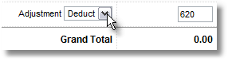

## Abono Factura

- Añadir un producto ficticio denominado "Abono factura" con precio 0
- Acceder a la factura que hay que abonar
- Pulsar el botón de Duplicar
- Añadir a la referencia " - Abono"
- Cambiar el estado a "Abonada"
- Al pie de la factura seleccionar Ajuste y establecer a "Deducir" con el valor total del abono

- Editar la primera linea de producto:
  - Seleccionar el producto "Abono factura"
  - Cantidad 1
  - Precio 0
- Eliminar todas las demás líneas

- Guardar e imprimir

Alternativamente, en coreBOS, podemos poner unidades y precios en negativo, así que en vez de eliminar todas las líneas y añadir una deducción, también se puede poner todas las unidades en negativo consiguiendo lo mismo.
