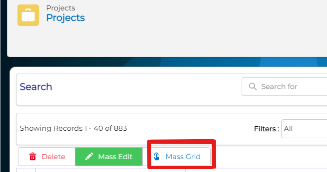
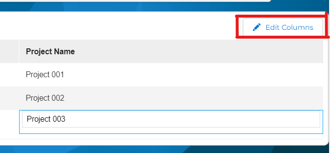

Mass Create Grid is a MassUpsertGridView map type that can help you create many records by just simple steps in a very easy way.

===

Firstly we have to create a map and select the target module where we want the function to take place. An example of the map implemented in the Project module could be:

```xml
<map>
  <originmodule>
    <originname>Project</originname>   (the target module)
  </originmodule>
  <match>
    <field>description</field>   (the field names are optional; they can be edited later in the list view)
    <field>projectname</field>
  </match>
  <columns>
    <field>
      <name>smownerid</name>
      <relatedModule/>
    </field>
    <field>
      <name>description</name>
      <relatedModule/>
    </field>
    <field>
      <name>projectname</name>
      <relatedModule/>
    </field>
  </columns>
</map>
```

The map can be implemented in any module associated with an action link ([BusinessAction](../../03.business-actions)). Action links are hooks into the user interface that can be created directly in the database without having to change any code. In our case the code would be: 

```JS
javascript:gotourl('index.php?action=MassCreateGrid&module=Project&bmapname=MassGridProjects');
```

**MassGridProjects** is the name of the map that we created before, so in a nutshell we link the map name to the button.

Below are shown some pictures of how the implementation works:



The button permits us to enter in the create view where we can select the columns that we want to see and copy-paste the data.



**Edit Columns:** To enter in the edit mode and select the desired columns.


The picture above shows us the view of the Mass Create Grid, so as we mentioned before the columns are editable from here dynamically without being constrained to select them in the map.


In order to manage duplicates, the **Select columns to match in grid** section comes in handy. Firstly as we mentioned you choose the columns that you want to be shown in the grid (List View). After, you select the fields where we want to check for duplicates and if you paste a line with some values which exist in CRM, they will be updated. Unless you check the matching boxes the function will always create records because in this case we do not care for duplicates.
