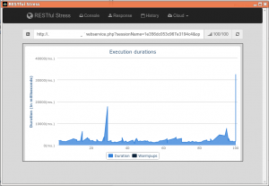

Select with limit and related
-----------------------------

Using the very useful [RESTful Stress Chrome application](https://chrome.google.com/webstore/detail/restful-stress/lljgneahfmgjmpglpbhmkangancgdgeb)
I ran a set of test on some of the webservice interface functionality.

This is definitely not rigorous nor exact, I have not controlled any of
the many variables that can influence the results. I just launched the
tests while I was working against a live server. None the less I
understand that the results must mean something and, at least, give some
orientation.

This is the general setup screen: I launched each select query 100 times
after 4 warmup calls with an interval of 1 second between each call.


**select \* from Municipios limit 371;**


<!DOCTYPE html>
<html>
<meta name="viewport" content="width=device-width, initial-scale=1">
<style>
body {
  font-family: Arial;
  margin: 0;
}
* {
  box-sizing: border-box;
}
img {
  vertical-align: middle;
}
/* Position the image container (needed to position the left and right arrows) */
.container {
  position: relative;
}
/* Hide the images by default */
.mySlides {
  display: none;
}
/* Add a pointer when hovering over the thumbnail images */
.cursor {
  cursor: pointer;
}
/* Next & previous buttons */
.prev,
.next {
  cursor: pointer;
  position: absolute;
  top: 40%;
  width: auto;
  padding: 16px;
  margin-top: -50px;
  color: white;
  font-weight: bold;
  font-size: 20px;
  border-radius: 0 3px 3px 0;
  user-select: none;
  -webkit-user-select: none;
}
/* Position the "next button" to the right */
.next {
  right: 0;
  border-radius: 3px 0 0 3px;
}
/* On hover, add a black background color with a little bit see-through */
.prev:hover,
.next:hover {
  background-color: rgba(0, 0, 0, 0.8);
}
/* Number text (1/3 etc) */
.numbertext {
  color: #f2f2f2;
  font-size: 12px;
  padding: 8px 12px;
  position: absolute;
  top: 0;
}
/* Container for image text */
.caption-container {
  text-align: center;
  background-color: #222;
  padding: 2px 16px;
  color: white;
}
.row:after {
  content: "";
  display: table;
  clear: both;
}
/* Six columns side by side */
.column {
  float: left;
  width: 16.66%;
}
/* Add a transparency effect for thumnbail images */
.demo {
  opacity: 0.6;
}
.active,
.demo:hover {
  opacity: 1;
}
</style>
<body>

<h2 style="text-align:center">Slideshow Gallery</h2>

<div class="container">
  <div class="mySlides">
    <div class="numbertext">1 / 6</div>
    
  </div>

  <div class="mySlides">
    <div class="numbertext">2 / 6</div>
    
  </div>

  <div class="mySlides">
    <div class="numbertext">3 / 6</div>
    
  </div>
    
  <div class="mySlides">
    <div class="numbertext">4 / 6</div>
    
  </div>

  <div class="mySlides">
    <div class="numbertext">5 / 6</div>
    
  </div>
    
  <div class="mySlides">
    <div class="numbertext">6 / 6</div>
    
  </div>
    
  <a class="prev" onclick="plusSlides(-1)">❮</a>
  <a class="next" onclick="plusSlides(1)">❯</a>

  <div class="caption-container">
    <p id="caption"></p>
  </div>

  <div class="row">
    <div class="column">
      
    </div>
    <div class="column">
      
    </div>
    <div class="column">
      
    </div>
    <div class="column">
      
    </div>
    <div class="column">
      
    </div>    
    <div class="column">
      
    </div>
  </div>
</div>

<script>
let slideIndex = 1;
showSlides(slideIndex);

function plusSlides(n) {
  showSlides(slideIndex += n);
}

function currentSlide(n) {
  showSlides(slideIndex = n);
}

function showSlides(n) {
  let i;
  let slides = document.getElementsByClassName("mySlides");
  let dots = document.getElementsByClassName("demo");
  let captionText = document.getElementById("caption");
  if (n > slides.length) {slideIndex = 1}
  if (n < 1) {slideIndex = slides.length}
  for (i = 0; i < slides.length; i++) {
    slides[i].style.display = "none";
  }
  for (i = 0; i < dots.length; i++) {
    dots[i].className = dots[i].className.replace(" active", "");
  }
  slides[slideIndex-1].style.display = "block";
  dots[slideIndex-1].className += " active";
  captionText.innerHTML = dots[slideIndex-1].alt;
}
</script>
    
</body>
</html>


**select \* from Municipios where related.provincias='39x332';** (which
returns 371 records, so the comparison is on the same number of records
of the same type)

&lt;imageflow:en:devel:corebosws:rel371&gt;&lt;/imageflow&gt;


**a set of different size selects against the same server and same module**


&lt;imageflow:en:devel:corebosws:selotr&gt;&lt;/imageflow&gt;


The numbers are (all values are in microseconds):

<table class="table table-striped">
<th>select 10 records</th>
<th></th>
</tr>
</thead>
<tbody>
<tr class="odd">
<td>1</td>
<td>292</td>
</tr>
<tr class="even">
<td>2</td>
<td>304</td>
</tr>
<tr class="odd">
<td>Avg</td>
<td>298</td>
</tr>
<tr class="even">
<td>Time per record</td>
<td>29.8</td>
</tr>
</tbody>
</table>

<table class="table table-striped">
<th>select 6000 records</th>
<th></th>
</tr>
</thead>
<tbody>
<tr class="odd">
<td>1</td>
<td>31033</td>
</tr>
<tr class="even">
<td>2</td>
<td>51137</td>
</tr>
<tr class="odd">
<td>Avg</td>
<td>41085</td>
</tr>
<tr class="even">
<td>Time per record</td>
<td>6.8</td>
</tr>
</tbody>
</table>

<table class="table table-striped">
<th>select 332 records</th>
<th></th>
</tr>
</thead>
<tbody>
<tr class="odd">
<td>1</td>
<td>1738</td>
</tr>
<tr class="even">
<td>2</td>
<td>2071</td>
</tr>
<tr class="odd">
<td>3</td>
<td>1774</td>
</tr>
<tr class="even">
<td>4</td>
<td>1192</td>
</tr>
<tr class="odd">
<td>Avg</td>
<td>1694</td>
</tr>
<tr class="even">
<td>Time per record</td>
<td>5.1</td>
</tr>
</tbody>
</table>

<table class="table table-striped">
<th>select 371 records</th>
<th></th>
</tr>
</thead>
<tbody>
<tr class="odd">
<td>1</td>
<td>2676</td>
</tr>
<tr class="even">
<td>2</td>
<td>2354</td>
</tr>
<tr class="odd">
<td>3</td>
<td>1611</td>
</tr>
<tr class="even">
<td>4</td>
<td>1547</td>
</tr>
<tr class="odd">
<td>5</td>
<td>2316</td>
</tr>
<tr class="even">
<td>6</td>
<td>2977</td>
</tr>
<tr class="odd">
<td>7</td>
<td>1549</td>
</tr>
<tr class="even">
<td>Avg</td>
<td>2147</td>
</tr>
<tr class="odd">
<td>Time per record</td>
<td>5.7</td>
</tr>
</tbody>
</table>

<table class="table table-striped">
<th>select related 371 records</th>
<th></th>
</tr>
</thead>
<tbody>
<tr class="odd">
<td>1</td>
<td>1302</td>
</tr>
<tr class="even">
<td>2</td>
<td>2467</td>
</tr>
<tr class="odd">
<td>3</td>
<td>3274</td>
</tr>
<tr class="even">
<td>4</td>
<td>3274</td>
</tr>
<tr class="odd">
<td>5</td>
<td>1483</td>
</tr>
<tr class="even">
<td>6</td>
<td>1433</td>
</tr>
<tr class="odd">
<td>7</td>
<td>3037</td>
</tr>
<tr class="even">
<td>Avg</td>
<td>2324</td>
</tr>
<tr class="odd">
<td>Time per record</td>
<td>6.2</td>
</tr>
</tbody>
</table>

It is interesting to see that the time per record decreases as the
number of records retrieved goes up, which seems logical as the setup
time is divided among all the records.

The original question that motivated these tests was if a select using
the [related record enhancements](http://localhost/coreBOSDocumentation/configuration-tools/webservice-development/querylanguage#related-entity-query-syntax)
was faster or slower than a normal select. From the tests above it seems
that a normal select is a little faster which also seems logical due to
the extra effort to establish the relation and then the extra join in
the query.

Create records
--------------

The stress creation test was performed using the [Siege tool available
at joedog.org](http://www.joedog.org/siege-manual/). With this very
powerful tool it is easy to launch any amount of concurrent transactions
against the coreBOS webservice interface.

The question I was trying to answer with the tests was: <div class="notices yellow"> "How long will it take to **create 2300 records** via
REST?".</div> To answer this question I launched this test:
```
    http://your_server/your_corebos/webservice.php
     POST
     sessionName=6906a95d53ca39308580c
     &operation=create
     &elementType=Services
     &element={"servicename":"srvrest2","assigned_user_id":"19x1","unit_price":"23","description":"just some random text so the rest call has some information being sent","qty_per_unit":"2"}
```

I launched this **230 times** with **10 concurrent users** twice and
then I launched it **115 times** with **20 concurrent users**. I did
those 4 tests against two different servers.

<table class="table table-striped">
<th>Server 1</th>
<th>Server 2</th>
</tr>
</thead>
<tbody>
<tr class="odd">
<td>Intel(R) Xeon(R) CPU E5320 @ 1.86GHz<br />
8 core with 8Gb<br />
ST3300655SS • Cheetah® 15K.5 SAS 3Gb/s 300GB Hard Drive</td>
<td>Intel(R) Xeon(R) CPU E31220 @ 3.10GHz<br />
4 core with 8Gb<br />
SPS-DRV SAS HD M6612 de 450 GB, 15.000 rpm, LFF</td>
</tr>
</tbody>
</table>

**Server 1**

    Trans,  Elap Time,  Data Trans,  Resp Time,  Trans Rate,  Throughput,  Concurrent,    OKAY,   Failed
    2300,     595.77,           1,       2.04,        3.86,        0.00,        7.88,    2300,       0
    2300,     588.32,           1,       2.02,        3.91,        0.00,        7.89,    2300,       0
    2300,     591.97,           1,       4.53,        3.89,        0.00,       17.61,    2300,       0
    2300,     591.91,           1,       4.49,        3.89,        0.00,       17.45,    2300,       0

Average time is 591.99

**Server 2**

    Trans,  Elap Time,  Data Trans,  Resp Time,  Trans Rate,  Throughput,  Concurrent,    OKAY,   Failed
    2300,     469.91,           1,       1.47,        4.89,        0.00,        7.22,    2300,       0
    2300,     466.26,           1,       1.46,        4.93,        0.00,        7.23,    2300,       0
    2300,     455.86,           1,       3.22,        5.05,        0.00,       16.23,    2300,       0
    2300,     474.59,           1,       3.28,        4.85,        0.00,       15.90,    2300,       0

Average time is 466.65

It is curious to see that although I double the concurrency the creation
time stays stable, which I understand means that it doesn't matter how
many requests you get, the creation time is the same (as long as you
don't saturate the server resources in which case the bottle neck would
move elsewhere).

The difference between one server and the other is incredible (really!),
591.99-466.65=125.34 **2 minutes!!**. So our first conclusion is
something I have been saying for ages: hardware, specially hard disk is
of utmost importance.

We are roughly talking about **8-10 minutes to create 2300 records**
which is **287-230 records per minute** but we have to keep in mind that
I intentionally picked a module with NO workflows associated. If we
launched these tests against HelpDesk I'm sure the difference would be
worse.

### vtiger CRM Comparison

Just for fun I tried the same set of test against a vtiger CRM 5.4 on
server 2 that seemed to be doing better than server 1. These are the
results:

**Server 2 vtiger CRM**

    Trans,  Elap Time,  Data Trans,  Resp Time,  Trans Rate,  Throughput,  Concurrent,    OKAY,   Failed
    2300,     547.00,           1,       1.84,        4.20,        0.00,        7.72,    2300,       0
    2300,     540.27,           1,       1.81,        4.26,        0.00,        7.71,    2300,       0
    2298,     546.74,           1,       4.02,        4.20,        0.00,       16.92,    2298,       2
    2300,     570.77,           1,       4.13,        4.03,        0.00,       16.66,    2300,       0

It can be clearly seen that the effort we are putting in on
optimizations and other enhancements are working: it is **over 1 minute
difference!!**
